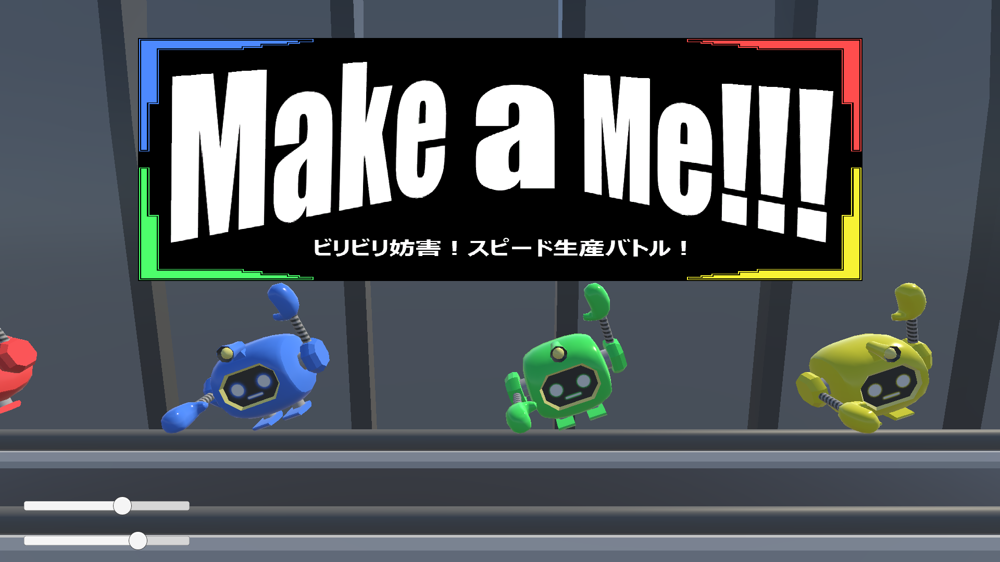
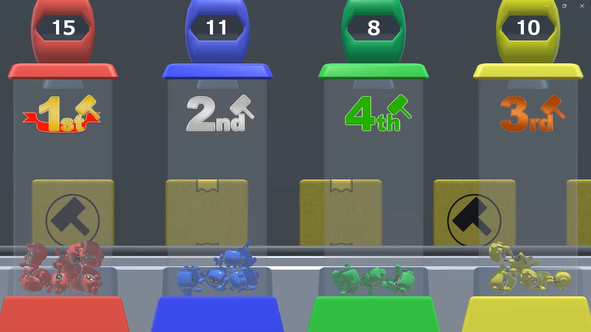

# Make-a-ME

## ファイル構成
* [Unityデータ](./ProjectData/)
* [ビルドデータ](./BuildData/)

## 概要

## ジャンル
4人対戦パーティゲーム

##入力
コントローラー（SwichProController）

## 担当プログラムファイル
* [エネルギー処理](./ProjectData/Assets/Hateruma/Scripts/EnergyScript.cs/)
* [バッテリー処理](./ProjectData/Assets/Hateruma/Scripts/EnergyBatteryScript.cs/)
* [コントローラー割り当て処理](./ProjectData/Assets/Hateruma/Scripts/ControllerBindScript.cs/)

## ゲームルール
このゲームはステージ上にある各プレイヤーの作業場で誰よりも自身のクローンを組み立てることが目的のゲーム。
また、ステージ上にあるバッテリーから得られるエネルギーでプレイヤーはレベルアップでき、作業速度を上げられる。
バッテリーは投げることで放電し、他のプレイヤーに範囲攻撃が出来る。組み立てと妨害を状況に応じて行いつつ、
勝利を目指す。

## Unityバージョン
Unity 2022.3.24f1

## 製作期間
11カ月(2024年10月~2025年9月)
※初期作「ENERGYHUNT」をもとに改良を重ねた後継版

## メンバー（役割）
* [友利徠夢]（プログラマー）
* [波照間煌斗]（プログラマー）
* [前田祐貴]（プログラマー）
* [仲里琉偉]（デザイナー）
* [宮里謙吾]（デザイナー）

## ゲームスクリーンショット

